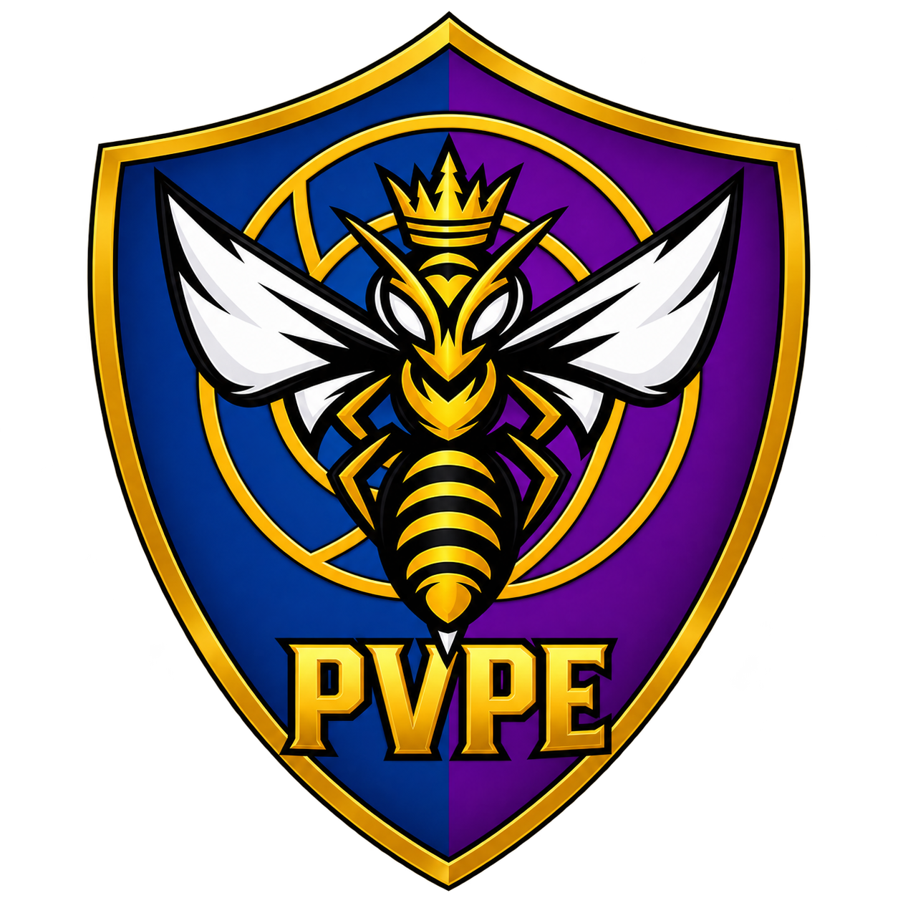

<div align="center">



# PVPE — Projeto de Vôlei Pedro Eduardo

Site institucional e painel administrativo do **PVPE**, projeto social de vôlei de Uruçuca - BA.


</div>

---

## Sumário

- [Visão geral](#visão-geral)
- [Funcionalidades](#funcionalidades)
- [Tecnologias](#tecnologias)
- [Rotas](#rotas)
- [Começando](#começando)
- [Variáveis de ambiente](#variáveis-de-ambiente)
- [Configurando o Supabase](#configurando-o-supabase)
- [Modo local × modo Supabase](#modo-local--modo-supabase)
- [Painel administrativo](#painel-administrativo)
- [Modelo de dados](#modelo-de-dados)
- [Estrutura do projeto](#estrutura-do-projeto)
- [Arquitetura](#arquitetura)
- [Deploy na Vercel](#deploy-na-vercel)
- [Guia de manutenção](#guia-de-manutenção)
- [Solução de problemas](#solução-de-problemas)
- [Créditos](#créditos)

---

## Visão geral

O projeto é composto por três partes:

1. **Página inicial** — apresentação do projeto, parceiros, últimos jogos, campeonato em destaque, chamadas para apoio e participação, depoimentos e redes sociais.
2. **Páginas de campeonato** — uma página-modelo que atende qualquer campeonato cadastrado (ex.: `/copa-do-mel`), com contador regressivo, times, inscrições e premiação.
3. **Painel administrativo** (`/p-admin`) — gerenciamento de jogos, campeonatos, telefones e parceiros, sem precisar mexer no código.

Os dados ficam no **Supabase** (Postgres, autenticação e armazenamento de imagens). Sem o Supabase configurado, o projeto funciona em **modo local**, ideal para desenvolvimento.

---

## Funcionalidades

### Site público

- Layout responsivo, fiel ao design original, do celular (375 px) ao desktop.
- Botões de WhatsApp com **mensagens automáticas** diferentes para cada ação (contato, apoiar, fazer parte, redes sociais, campeonato).
- **Modal de pedido de camisa**: o visitante escolhe modelo (masculina/feminina) e tamanho (PP a XG) e é levado ao WhatsApp com o pedido pronto.
- Seção de parceiros com logo ou, na falta dela, o nome — sempre com pelo menos 5 espaços (os excedentes ficam vazios).
- Últimos jogos com placar, evento, resultado e data.
- Banner do campeonato em destaque com link para a página dele.

### Páginas de campeonato

- **Contador regressivo** até o início, que muda para "O campeonato está rolando!" durante o evento e "Encerrado" ao final.
- Datas no **horário da Bahia** (`America/Bahia`), iguais para qualquer visitante.
- Listas de times feminino e masculino, valor de inscrição (com selo **"Inscrições encerradas"**) e premiação.
- Layout adaptável: blocos sem conteúdo não aparecem; sem logo, o nome do campeonato ocupa o banner; sem imagem de fundo, usa um degradê da identidade visual.
- Título, descrição e imagem de compartilhamento (Open Graph) gerados por campeonato.

### Painel administrativo

- CRUD completo de **jogos, campeonatos, telefones e parceiros**.
- Upload de imagens (logos e banners) direto para o Supabase Storage.
- Regras de consistência: um único campeonato em destaque, um único telefone principal, endereço de campeonato único e sem conflito com rotas do site.
- Login com e-mail e senha (Supabase Auth).

---

## Tecnologias

| Camada | Tecnologia |
|---|---|
| Framework | [Next.js 16](https://nextjs.org) (App Router, Turbopack) |
| UI | React 19 + CSS puro (sem framework de estilos) |
| Linguagem | TypeScript 5 |
| Fonte | Roboto via `next/font` |
| Banco de dados | Supabase (Postgres) com Row Level Security |
| Autenticação | Supabase Auth (e-mail e senha) |
| Imagens enviadas | Supabase Storage (bucket público `pvpe`) |
| Cliente | `@supabase/supabase-js` 2 |
| Qualidade | ESLint 9 (`eslint-config-next`) e checagem de tipos |
| Hospedagem recomendada | Vercel |

---

## Rotas

| Rota | Tipo | Descrição |
|---|---|---|
| `/` | Estática com revalidação (60 s) | Página inicial |
| `/[slug]` | Dinâmica | Página de um campeonato, pelo endereço cadastrado (ex.: `/copa-do-mel`) |
| `/campeonato` | Redirecionamento | Leva ao campeonato em destaque. Também aceita o formato antigo `/campeonato?c=slug` |
| `/p-admin` | Cliente | Painel administrativo (não indexado por buscadores) |
| qualquer outra | 404 | Página "Essa página saiu da quadra" |

---

## Começando

### Pré-requisitos

- [Node.js](https://nodejs.org) **20.9 ou superior** (o npm já vem junto)
- Uma conta no [Supabase](https://supabase.com) — opcional para desenvolvimento

### Instalação

```bash
git clone https://github.com/codemawk-dev/PVPE.git
cd PVPE
npm install
```

### Rodando em desenvolvimento

```bash
npm run dev
```

Acesse **http://localhost:3000**. Sem variáveis de ambiente, o projeto sobe em [modo local](#modo-local--modo-supabase).

### Scripts

| Comando | O que faz |
|---|---|
| `npm run dev` | Servidor de desenvolvimento com recarregamento automático |
| `npm run build` | Build de produção (inclui checagem de tipos) |
| `npm run start` | Sobe o build de produção |
| `npm run lint` | Analisa o código com ESLint |

---

## Variáveis de ambiente

Copie o modelo e preencha com os dados do seu projeto Supabase (**Project Settings → API**):

```bash
cp .env.example .env.local
```

| Variável | Obrigatória | Descrição |
|---|---|---|
| `NEXT_PUBLIC_SUPABASE_URL` | Sim* | URL do projeto, ex.: `https://xxxx.supabase.co` |
| `NEXT_PUBLIC_SUPABASE_ANON_KEY` | Sim* | Chave pública `anon` |
| `NEXT_PUBLIC_SUPABASE_BUCKET` | Não | Bucket das imagens. Padrão: `pvpe` |

\* Sem elas o projeto roda em modo local.

> [!WARNING]
> **Nunca** use a chave `service_role` (ou `secret`) neste projeto. Variáveis `NEXT_PUBLIC_` são enviadas ao navegador, e essa chave ignora todas as regras de segurança do banco. A chave `anon` é pública por natureza: a proteção dos dados vem das políticas RLS.

Arquivos `.env*` estão no `.gitignore` e nunca são enviados ao repositório (exceto o `.env.example`).

---

## Configurando o Supabase

1. **Crie o banco.** No painel do Supabase, abra o **SQL Editor** e rode o arquivo [`supabase/schema.sql`](supabase/schema.sql) inteiro. Ele cria:
   - as tabelas `games`, `championships`, `phones` e `partners`;
   - os gatilhos de `updated_at` e os índices;
   - as **políticas RLS** (leitura pública, escrita só para usuários logados);
   - as **permissões (GRANT)** dos papéis `anon` e `authenticated`;
   - o bucket público **`pvpe`** no Storage, com suas políticas;
   - os **dados iniciais** do site.

   O script é idempotente: pode ser executado novamente sem duplicar nada.

2. **Configure as variáveis** conforme a seção [Variáveis de ambiente](#variáveis-de-ambiente).

3. **Crie o usuário administrador** em **Authentication → Users → Add user**.

4. **Desative novos cadastros** em **Authentication → Sign In / Providers → Email → Allow new users to sign up**.

   > [!IMPORTANT]
   > As políticas permitem que **qualquer usuário autenticado** edite os dados. Com cadastro aberto, qualquer pessoa poderia criar uma conta e alterar o site.

5. **Reinicie** o `npm run dev`. O painel passa a pedir login e o site passa a ler do banco.

---

## Modo local × modo Supabase

O projeto escolhe o modo automaticamente, conforme as variáveis de ambiente.

| | Modo local (sem variáveis) | Modo Supabase |
|---|---|---|
| Dados do site | `lib/seed.ts` | Banco de dados |
| Onde o painel salva | `localStorage` do navegador | Banco de dados |
| Quem vê as alterações | Só o navegador que editou | Todos os visitantes |
| Login no painel | Não exigido | E-mail e senha |
| Upload de imagens | Convertidas e salvas no navegador | Supabase Storage |
| Atualização do site | Imediata (no próprio navegador) | Em até 60 s |

O modo local serve para desenvolvimento e demonstração. No painel, o botão **"Restaurar dados originais"** apaga as alterações locais.

---

## Painel administrativo

Acesse **`/p-admin`**. Cada seção lista os registros e permite **criar, editar e excluir**.

### Últimos jogos
Times, placar em sets, evento, resultado/categoria e data. Os **3 mais recentes** aparecem na página inicial (a data é exibida como mês/ano).

### Campeonatos
| Campo | Observação |
|---|---|
| Endereço da página | Define a URL (`copa-do-mel` → `/copa-do-mel`). Letras minúsculas, números e hífen; precisa ser único |
| Logo e imagem de fundo | Opcionais. Banner em formato largo (ex.: 2400 × 730) |
| Destaque na página inicial | Só um por vez: marcar um desmarca o anterior |
| Início e término | Controlam o contador. Sem início, não há contador |
| Times | Um time por linha, separados em feminino e masculino |
| Inscrições abertas | Desmarcado, exibe o selo "Inscrições encerradas" |

### Telefones
O telefone marcado como **principal** é usado em todos os botões de WhatsApp. O número é digitado com DDD (ex.: `(73) 99133-5759`) e o código do Brasil (55) é adicionado automaticamente.

### Parceiros
Nome, ramo, logo, link e ordem de exibição. A opção **"Logo com fundo próprio"** faz logos quadradas e coloridas preencherem o card inteiro. Sem logo — ou se ela não carregar —, o card mostra o nome.

---

## Modelo de dados

Definido em [`supabase/schema.sql`](supabase/schema.sql) e espelhado em [`lib/types.ts`](lib/types.ts). Todas as tabelas têm `id` (UUID), `created_at` e `updated_at`.

**`games`** — `team_home`, `team_away`, `score_home`, `score_away`, `event`, `result`, `played_at`

**`championships`** — `slug` (único), `name`, `starts_at`, `ends_at`, `date_label`, `time_label`, `location`, `description`, `teams_female[]`, `teams_male[]`, `registration_fee`, `registration_fee_note`, `registrations_open`, `prize_first`, `prize_first_extra`, `prize_second`, `logo_url`, `banner_url`, `featured` (no máximo um)

**`phones`** — `label`, `number` (só dígitos, com DDI), `is_primary` (no máximo um)

**`partners`** — `name`, `segment`, `logo_url`, `logo_full`, `link_url`, `sort_order`

### Segurança

| Papel | Leitura | Escrita |
|---|---|---|
| `anon` (visitantes) | ✅ | ❌ |
| `authenticated` (painel) | ✅ | ✅ |

---

## Estrutura do projeto

```
├── app/
│   ├── layout.tsx              # Layout raiz: fonte, metadados e CSS global
│   ├── page.tsx                # Página inicial
│   ├── [slug]/page.tsx         # Página de campeonato
│   ├── campeonato/page.tsx     # Redirecionamento para o campeonato em destaque
│   ├── p-admin/page.tsx        # Painel administrativo
│   ├── not-found.tsx           # Página 404
│   └── styles/                 # style.css (site), campeonato.css, admin.css
├── components/
│   ├── landing/                # Seções da página inicial e modal da camisa
│   ├── championship/           # Página de campeonato, contador e ícones
│   ├── admin/                  # Painel: app, formulário e definição das seções
│   ├── Footer.tsx
│   └── icons.tsx
├── lib/
│   ├── types.ts                # Tipos das tabelas
│   ├── seed.ts                 # Dados iniciais (modo local)
│   ├── config.ts               # Leitura das variáveis de ambiente
│   ├── format.ts               # Telefone, datas, URLs de imagem, WhatsApp
│   ├── messages.ts             # Mensagens automáticas do WhatsApp e links fixos
│   └── data/
│       ├── server.ts           # Leitura no servidor (Supabase ou seed)
│       ├── client.ts           # Acesso no navegador (escolhe o modo)
│       ├── adapter.ts          # Interface comum dos modos
│       ├── local.ts            # Modo local (localStorage)
│       ├── supabase-browser.ts # Modo Supabase (painel)
│       └── use-local-data.ts   # Aplica os dados locais nas páginas
├── public/assets/img/          # Imagens do site
├── supabase/schema.sql         # Banco de dados
├── _legacy-static/             # Versão estática anterior (apenas referência)
└── .env.example                # Modelo das variáveis de ambiente
```

---

## Arquitetura

```
             ┌──────────────────────────┐
 Visitante → │  Páginas (Server Comp.)  │ → lib/data/server.ts ──→ Supabase (leitura, anon)
             │  revalidação de 60 s     │                     └─→ lib/seed.ts (modo local)
             └──────────────────────────┘
                          │ hidrata
                          ▼
             ┌──────────────────────────┐
             │  Componentes de cliente  │ → use-local-data.ts (aplica dados do localStorage
             │  (contador, modal…)      │                      somente no modo local)
             └──────────────────────────┘

 Admin     → /p-admin → lib/data/client.ts ──→ supabase-browser.ts (login, CRUD, upload)
                                          └─→ local.ts (modo local)
```

- As páginas públicas são renderizadas no servidor e chegam prontas ao navegador, o que é bom para SEO e para a pré-visualização de links.
- Com Supabase, as páginas são regeneradas no máximo a cada **60 segundos** (`revalidate = 60`).
- O painel e o site compartilham a mesma interface de dados (`DataAdapter`). Por isso, trocar de modo não exige mudar nenhum componente.
- O SDK do Supabase só é baixado no navegador quando está configurado.

---

## Deploy na Vercel

1. Importe o repositório em [vercel.com/new](https://vercel.com/new). O framework (Next.js) é detectado automaticamente.
2. Em **Settings → Environment Variables**, cadastre `NEXT_PUBLIC_SUPABASE_URL` e `NEXT_PUBLIC_SUPABASE_ANON_KEY` (e, se quiser, `NEXT_PUBLIC_SUPABASE_BUCKET`) para **Production, Preview e Development**.
3. Faça o deploy. Ao alterar variáveis depois, use **Redeploy**: variáveis `NEXT_PUBLIC_` são aplicadas no build.

---

## Guia de manutenção

### Adicionar um campo a uma seção do painel

1. Crie a coluna no banco (`alter table ... add column ...`) e registre-a em `supabase/schema.sql`.
2. Adicione o campo ao tipo em `lib/types.ts` (e ao `lib/seed.ts`, se houver valor inicial).
3. Declare o campo em `components/admin/resources.tsx`. Tipos disponíveis: `text`, `number`, `date`, `datetime`, `tel`, `url`, `textarea`, `lines`, `checkbox` e `image`.
4. Exiba o campo no componente da página correspondente.

### Alterar textos fixos

| O quê | Onde |
|---|---|
| Mensagens automáticas do WhatsApp, Instagram | `lib/messages.ts` |
| Textos da página inicial e depoimentos | `components/landing/sections.tsx` |
| Tamanhos e modelos de camisa | `components/landing/ShirtModal.tsx` |
| Título e descrição padrão do site | `app/layout.tsx` |

### Endereços reservados

Campeonatos não podem usar `p-admin`, `campeonato`, `assets`, `api` e `_next`, pois conflitariam com rotas do site. A lista está em `components/admin/resources.tsx`.

---

## Solução de problemas

<details>
<summary><b><code>permission denied for table games</code></b></summary>

O papel `anon` não tem permissão sobre as tabelas — comum em projetos Supabase que não liberam tabelas novas automaticamente para a API. Rode no SQL Editor:

```sql
grant usage on schema public to anon, authenticated;
grant select on public.games, public.championships, public.phones, public.partners
  to anon, authenticated;
grant insert, update, delete on public.games, public.championships, public.phones, public.partners
  to authenticated;
```

O `schema.sql` atual já inclui esse trecho.
</details>

<details>
<summary><b>As alterações do painel não aparecem no site</b></summary>

- **Modo Supabase:** aguarde até 60 segundos e recarregue a página.
- **Modo local:** as alterações só existem no navegador em que foram feitas.
- Confirme se as variáveis de ambiente estão definidas e reinicie o servidor (ou faça Redeploy na Vercel).
</details>

<details>
<summary><b>Login do painel recusado</b></summary>

Confira se o usuário existe em **Authentication → Users** e se o e-mail foi confirmado. Ao criar o usuário pelo painel do Supabase, marque **Auto Confirm User**.
</details>

<details>
<summary><b>Upload de imagem falha</b></summary>

Verifique se o bucket `pvpe` existe no Storage e se as políticas `pvpe_admin_*` foram criadas (ambos vêm do `schema.sql`). O limite por imagem no painel é de 5 MB.
</details>

<details>
<summary><b>Campeonato mostra "não encontrado"</b></summary>

Confira o **endereço da página** cadastrado no painel: a URL precisa ser exatamente `/<endereço>`.
</details>

---

## Créditos

Desenvolvido por **[codeMAWK](https://instagram.com/codemawk)**.

© 2026 PVPE — Projeto de Vôlei Pedro Eduardo · Uruçuca - BA
